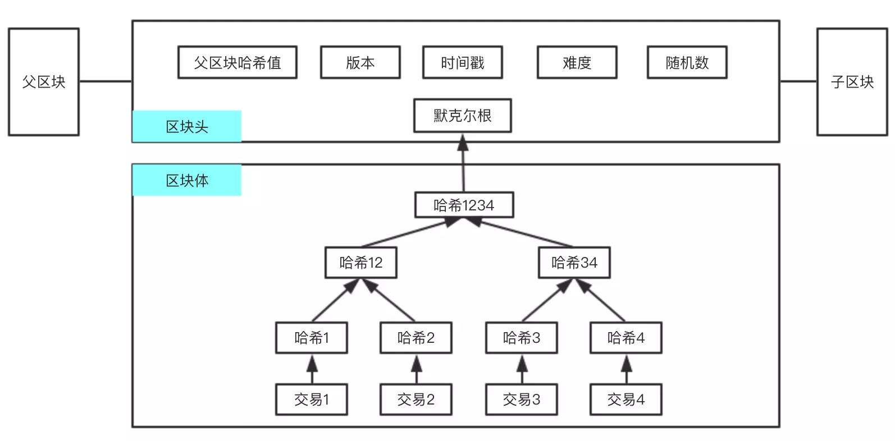

# 区块结构

**如上图所示，一般区块结构包括区块头和区块体**

## 区块头
| 字段             | 大小（字节） | 功能                                   |
| ---------------- | ------------ | -------------------------------------- |
| 版本             | 4            | 版本号                                 |
| 父亲区块链散列值 | 32           | 上一区块的散列值                       |
| Merkle根         | 32           | 交易记录构成的 Merkle 树的根           |
| 时间戳           | 4            | 区块产生的时间                         |
| 难度目标         | 4            | 当前区块工作量证明算法的难度目标       |
| 随机数           | 4            | 工作量证明算法中验证区块所用到的随机数 |

## 区块标识符

主要有两种：一种是区块的散列值，另一种是区块的高度

其中区块的散列值是通过两次 SHA256 散列函数计算得到的数字指纹，长度为32字节

## 创世区块

创世区块是比特币网络中床架你的第一个区块，是整个区块链的共同祖先，被静态写入比特币客户端软件中，以确保创世区块不会被改变，从而构建一个安全的、可信的区块链的根。

## 区块链式结构

